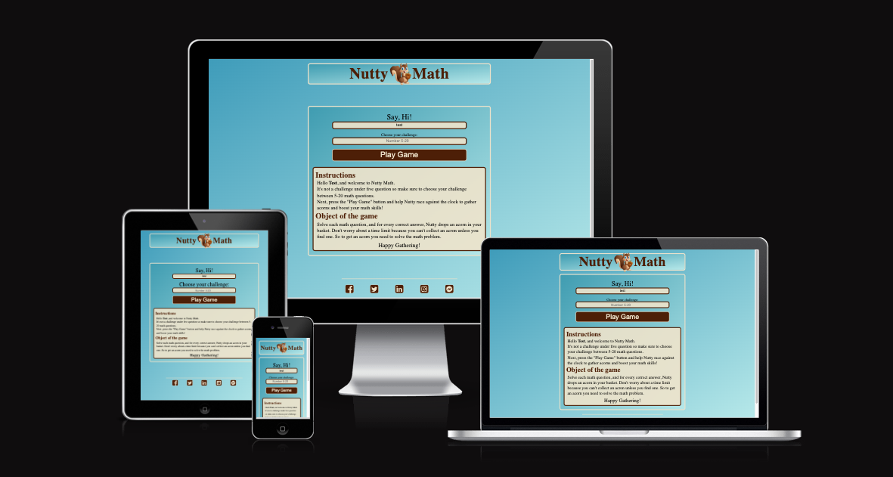

<div align="center"><h1>Nutty's Math Adventure</h1></div>




## Description 

*Nutty's Math Adventure* – Join Nutty, the irresistibly cute squirrel, in a quest to gather acorns throug engauging math-solving fun. Exercise your brain cells while helping Nutty gear up for the chilly winter ahead. Solve random math questions and watch as Nutty's stash grows. It's not just about numbers; it's about the joy of learning and the excitement of aiding Nutty in this adorable adventure. Let the acorn-collecting journey! 

website: https://craigb73.github.io/nutty-math/

## Table of Content 

1. [Description](#description)
2. [Table of Content](#table-of-content)
3. [Features](#features)
4. [Design and Color Reference](#design-and-color-reference)
5. [🛠 Tech Stack](#%F0%9F%9B%A0-tech-stack)
6. [Libraries](#libraries)
7. [Testing](#testing)
8. [Validation](#validation)
9. [Bugs](#bugs)
10. [Deployment](#deployment)
11. [Media/Images](#mediaimages)
12. [Credits and Acknowledgements](#credits-and-acknowledgements)

## Features
**Homepage -** Enter your name and number of math problems you want to chanllege yourself. When you type your name it is displayed in the instruction section of the home page. Within the instruction section you will also find the object of the game.
Press the play button which navigate you to the game page


**Gamepage -** The gamepage is where you start you challenge and bulid on you math skills. On the game page you have a scorebord and image of Nutty with a message bubble that provide encougagement as you play the game. Below the image and scorebord you math equation will be displayed. Check you answer by pressing the , "Check Answer" button. If correct player recieves an acor n and a new equation.

 

Once you completed you challenge you will be asked to play again. At anytime you can press the "Home" button which will take you back to the "Homepage" and reset the game.


**Footer:** Mock social links as placeholders to be created for players access and share their success.


**Social Media Links:**
- [Facebook](https://www.facebook.com)
- [X](https://www.x.com)
- [Instagram](https://www.instagram.com)
- [Messenger](https://www.messenger.com)

## Design and Color Reference
 Design link created in: [Figma](https://www.figma.com/file/uzQhUBLFXZnp77fvHifUTR/nutty_math?type=design&node-id=1%3A94&mode=design&t=ADPiRRybJDRygtgZ-1)

| Color             | Hex                                                                |
| ----------------- | ------------------------------------------------------------------ |
| Linear-gradient |  #3f9cba  #b6e8e9|
| Alt-Background |  #eee3cb |
| Header/Buttons |  #4d1f07 |
| Root Text |  #272829 |

## 🛠 Tech Stack


## Libraries
 - Font Awesome: Used in the footer and thumbnail icons
- Google Fonts
- GitHub: Use to store the project and deploy using GitHub' "Pages"

## Testing
- Google Chrome development tool for layout
- Functionality with different browers: 
  - Google 
  - Safari  
  - Firefox
- Tested(Responsiveness) on personal ios mobile device.
- Ensure seamless navigation to and from the gamepage by validating and clearing local storage when returning to Homepage.
- Checked the that the form validation work when entering player's name and the min-max challenge number.
- Ensured that all social navigation icons work and link to a new tap.

## Validation
- PageSpeed Insight: https://pagespeed.web.dev/analysis/https-craigb73-github-io-nutty-math/ic1070tu0t?form_factor=desktop

- W3C Validator for CSS


## Bugs
- ChatGBT(https://chat.openai.com/): 
  ```
   // Check if the result is a floating-point number within the function: 
   function generateMathProblem()  {
      if (!Number.isInteger(result)) {
        return generateMathProblem();
        }
    }
    ```
- No bugs on deployment were detected.
  
## Deployment 
- Deployment was performed using GitHub pages.
- Website link:  https://craigb73.github.io/nutty-math/

## Media/Images
Gamepage Squirrel Image:  https://www.midjourney.com/home
Mock Responsiveness: https://ui.dev/amiresponsive

## Credits and Acknowledgements
- Creation of tech stack badges: https://dev.to/envoy_/150-badges-for-github-pnk
https://www.iconfinder.com
- Content creation: https://chat.openai.com/